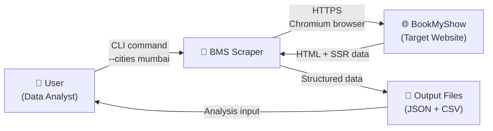
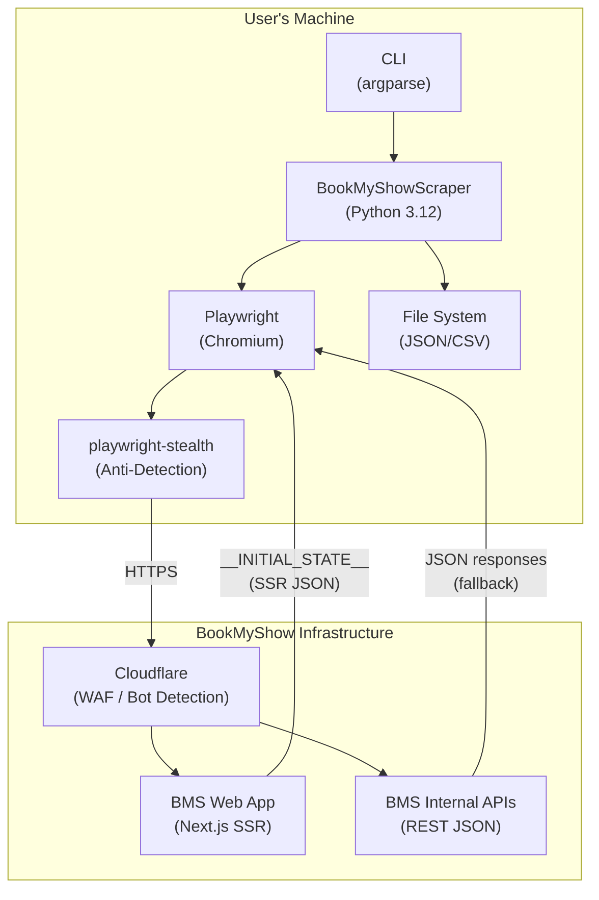
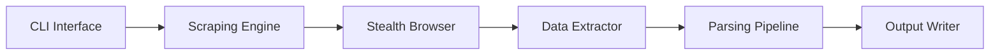
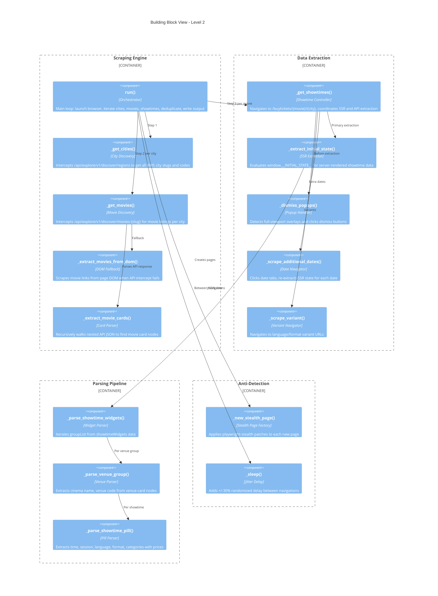
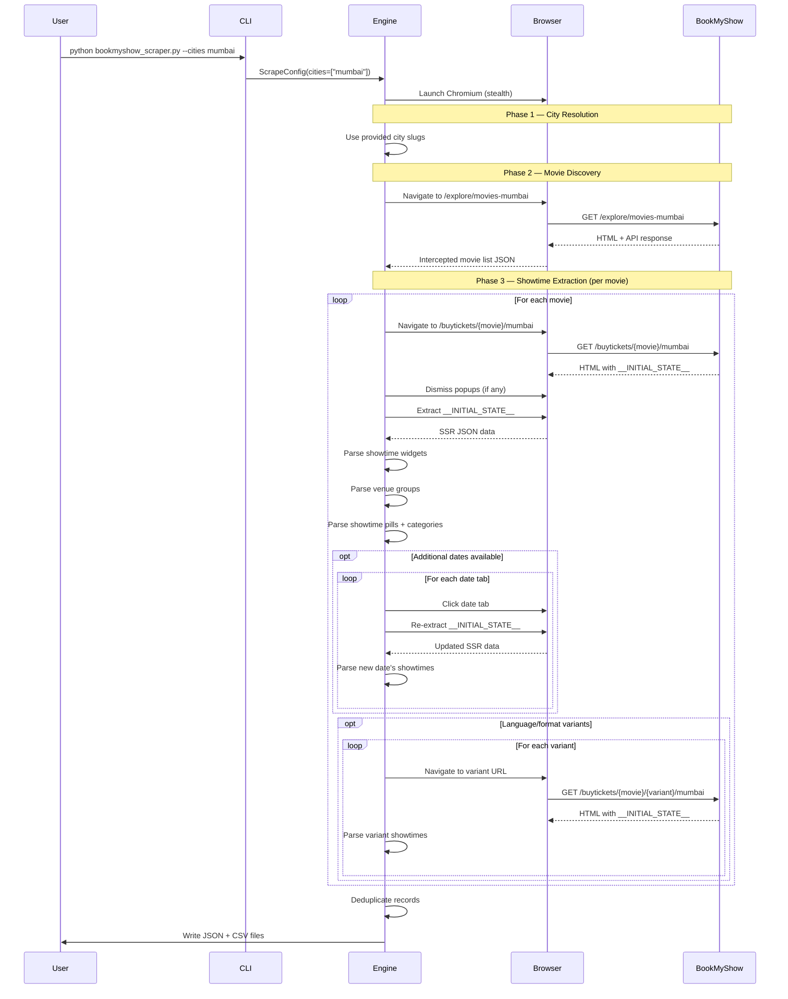
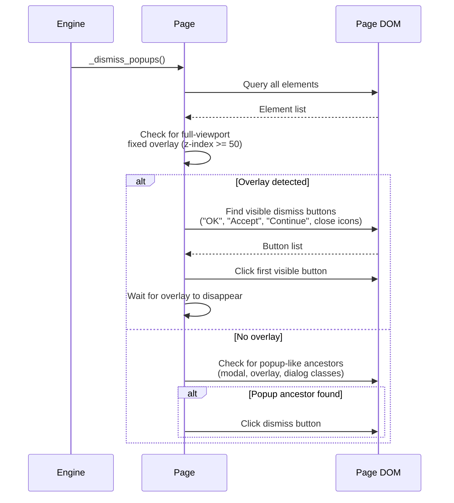
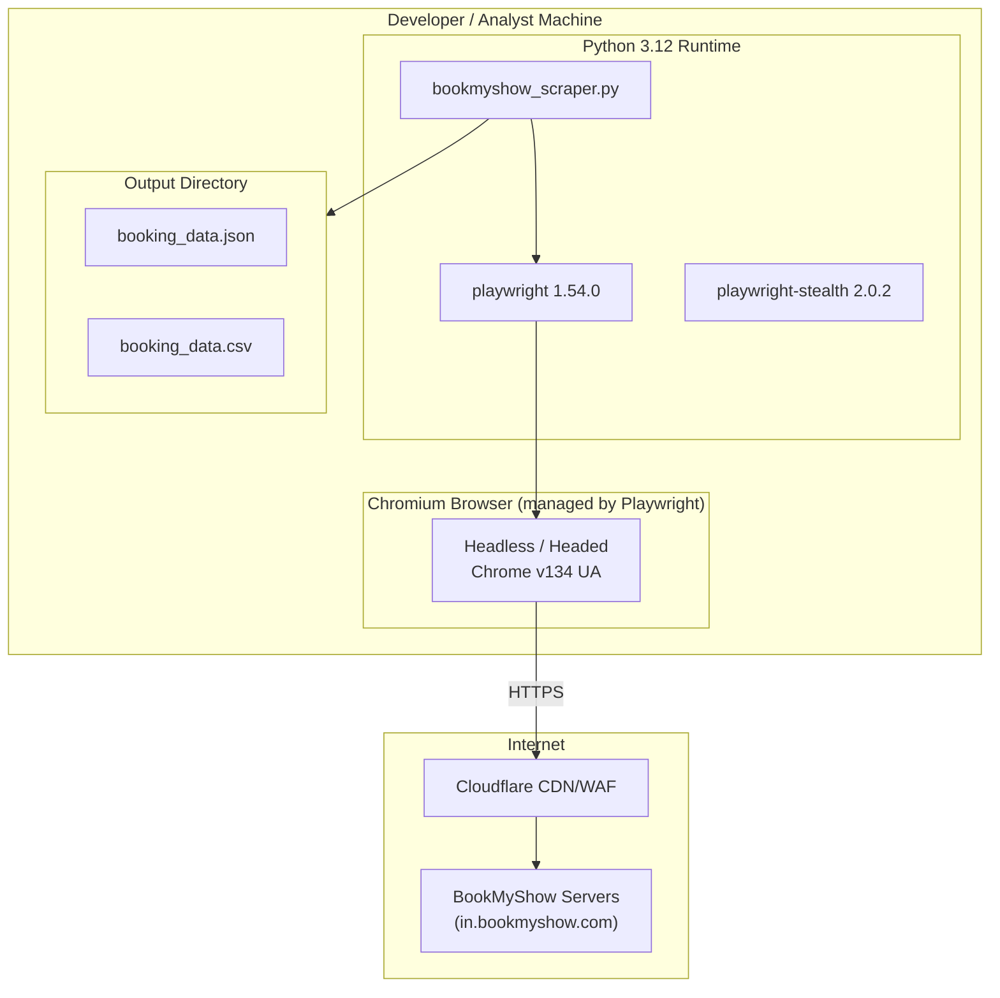
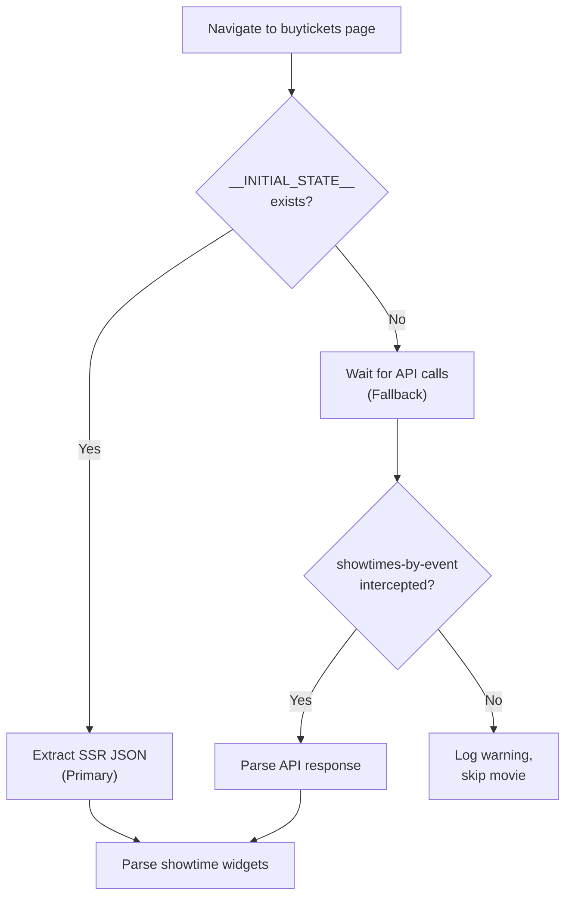
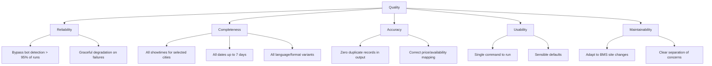

# BookMyShow Scraper — Arc42 Architecture Documentation

> Based on the [arc42 template](https://arc42.org/) v8.2

---

## 1. Introduction and Goals

### 1.1 Requirements Overview

The BMS Scraper is a command-line tool that extracts structured movie booking
data from [BookMyShow](https://in.bookmyshow.com) — India's largest online
entertainment ticketing platform.

**Core functional requirements:**

| ID   | Requirement                                                        |
|------|--------------------------------------------------------------------|
| FR-1 | Discover all available cities on BookMyShow                        |
| FR-2 | List currently showing movies per city                             |
| FR-3 | Extract showtimes with venue, date, time, language, and format     |
| FR-4 | Extract seat categories with prices and availability status        |
| FR-5 | Support multiple dates per movie (up to 7 days)                    |
| FR-6 | Support language/format variants (e.g., Hindi 2D vs English IMAX)  |
| FR-7 | Output structured data as JSON and CSV                             |
| FR-8 | Allow filtering by specific cities via CLI                         |

**Quality goals:**

| Priority | Goal            | Description                                                |
|----------|-----------------|------------------------------------------------------------|
| 1        | Reliability     | Bypass bot detection to consistently extract data          |
| 2        | Completeness    | Capture all showtimes across dates, languages, and formats |
| 3        | Accuracy        | Output verified, deduplicated records                      |
| 4        | Usability       | Simple CLI with sensible defaults                          |

### 1.2 Stakeholders

| Role             | Expectations                                            |
|------------------|---------------------------------------------------------|
| Data Analyst     | Clean, structured CSV/JSON data for analysis            |
| Researcher       | Comprehensive coverage of cities, movies, and showtimes |
| Developer        | Maintainable code that adapts to BMS site changes       |

---

## 2. Architecture Constraints

### 2.1 Technical Constraints

| Constraint                | Description                                                    |
|---------------------------|----------------------------------------------------------------|
| No official API           | BMS does not provide a public data API                         |
| Bot detection             | BMS uses Cloudflare and JS-based bot detection                 |
| SSR rendering             | Showtime data is embedded in `window.__INITIAL_STATE__` (SSR)  |
| Dynamic DOM classes       | BMS uses styled-components with hashed class names             |
| Rate sensitivity          | Aggressive scraping triggers blocking                          |

### 2.2 Organizational Constraints

| Constraint                | Description                                          |
|---------------------------|------------------------------------------------------|
| Single-machine execution  | Runs locally on the user's machine                   |
| Python ecosystem          | Must use Python 3.12+ with pip-installable deps      |
| Open source               | MIT licensed, no proprietary dependencies            |

### 2.3 Conventions

| Convention                | Description                                          |
|---------------------------|------------------------------------------------------|
| Output schema             | Fixed 18-field CSV/JSON schema (see Section 8)       |
| Date format               | ISO 8601 (`YYYY-MM-DD`)                              |
| Time format               | 24-hour (`HH:MM`)                                    |
| Timestamps                | UTC ISO 8601                                         |

---

## 3. System Scope and Context

### 3.1 Business Context



### 3.2 Technical Context



**External interfaces:**

| Interface              | Protocol | Data Format | Purpose                         |
|------------------------|----------|-------------|---------------------------------|
| BMS Homepage           | HTTPS    | HTML + JS   | City discovery, movie listings  |
| BMS Buytickets Page    | HTTPS    | HTML + SSR  | Showtime data extraction        |
| BMS Regions API        | HTTPS    | JSON        | City list (API interception)    |
| BMS Movies API         | HTTPS    | JSON        | Movie list (API interception)   |
| Local File System      | File I/O | JSON, CSV   | Output data storage             |

---

## 4. Solution Strategy

| Decision                          | Rationale                                                                 |
|-----------------------------------|---------------------------------------------------------------------------|
| **Playwright over requests/Selenium** | Full browser needed to bypass Cloudflare JS challenges; Playwright is faster than Selenium with better API |
| **SSR extraction over API interception** | BMS migrated from runtime API calls to server-side rendering; `__INITIAL_STATE__` is the primary data source |
| **API interception as fallback**  | Some pages may still use runtime API calls; keeping both strategies maximizes reliability |
| **playwright-stealth**            | Patches `navigator.webdriver`, plugins, and other fingerprinting vectors to evade bot detection |
| **Headed mode by default**        | Cloudflare JS challenge sometimes requires visible browser; headless available as CLI flag |
| **Random jitter delays**          | ±30% variation on all sleeps to avoid request-pattern detection |
| **Deduplication at output**       | Date/variant scraping may produce overlapping records; JSON-key dedup ensures clean output |

---

## 5. Building Block View

### 5.1 Level 1 — Overall System



### 5.2 Level 2 — Component Breakdown



### 5.3 Whitebox — SSR Data Structure

The primary data source is `window.__INITIAL_STATE__` embedded in the buytickets
page. The relevant path through the JSON:

```
__INITIAL_STATE__
└── showtimesByEvent
    └── showDates
        └── {dateCode}              (e.g., "20260307")
            ├── primaryStatic
            │   └── data
            │       ├── eventData   (movie metadata)
            │       └── childEvents (language/format variants)
            └── dynamic
                └── data
                    └── showtimeWidgets
                        └── groupList[]
                            └── venueGroup
                                └── venue-card
                                    ├── venueName, venueCode
                                    └── showtimes[]
                                        ├── showTime, sessionId
                                        ├── categories[] (seat types + prices)
                                        └── availStatus (0-3)
```

---

## 6. Runtime View

### 6.1 Main Scraping Flow



### 6.2 Popup Dismissal Flow



---

## 7. Deployment View



**Installation steps:**

```bash
pip install playwright playwright-stealth
playwright install chromium
python bookmyshow_scraper.py --cities mumbai
```

---

## 8. Cross-cutting Concepts

### 8.1 Anti-Detection Strategy

The scraper employs a layered approach to evade bot detection:

```mermaid
graph LR
    subgraph Layer1["Layer 1: Browser Fingerprint"]
        A1["playwright-stealth patches"]
        A2["navigator.webdriver = false"]
        A3["Realistic plugin list"]
        A4["Language headers"]
    end

    subgraph Layer2["Layer 2: Launch Args"]
        B1["--disable-blink-features=<br/>AutomationControlled"]
        B2["--no-first-run"]
        B3["--no-default-browser-check"]
    end

    subgraph Layer3["Layer 3: Context Spoofing"]
        C1["Chrome v134 User-Agent"]
        C2["Viewport 1366x768"]
        C3["Locale en-IN"]
        C4["Timezone Asia/Kolkata"]
        C5["Accept-Language header"]
    end

    subgraph Layer4["Layer 4: Behavioral"]
        D1["Random jitter ±30%"]
        D2["Polite delay between pages"]
        D3["Headed mode (default)"]
    end

    Layer1 --> Layer2 --> Layer3 --> Layer4
```



### 8.2 Data Extraction Strategy



### 8.3 Error Handling

| Scenario                     | Strategy                                       |
|------------------------------|------------------------------------------------|
| Popup blocks interaction     | `_dismiss_popups()` auto-detects and dismisses  |
| SSR state missing            | Falls back to API interception                 |
| API interception timeout     | Logs warning, continues to next movie          |
| Movie page fails to load     | Caught by try/except, continues to next movie  |
| Rate limiting / blocking     | Jitter delays + headed mode reduce occurrence  |
| Duplicate records            | Post-scrape JSON-key deduplication             |

### 8.4 Output Data Schema

| #  | Field                   | Type   | Description                                   |
|----|-------------------------|--------|-----------------------------------------------|
| 1  | `city`                  | string | City slug (e.g., `mumbai`)                    |
| 2  | `movie`                 | string | Movie title                                   |
| 3  | `event_code`            | string | BMS event identifier (e.g., `ET00412345`)     |
| 4  | `cinema`                | string | Cinema / venue name                           |
| 5  | `venue_code`            | string | BMS venue identifier                          |
| 6  | `show_date`             | string | ISO date (`YYYY-MM-DD`)                       |
| 7  | `show_time`             | string | 24-hour time (`HH:MM`)                        |
| 8  | `session_id`            | string | BMS session identifier                        |
| 9  | `language`              | string | Audio language                                |
| 10 | `subtitle_language`     | string | Subtitle language (if any)                    |
| 11 | `format`                | string | Screening format (`2D`, `IMAX 2D`, `4DX`)    |
| 12 | `screen_type`           | string | Screen technology (`IMAX`, `Dolby Atmos`)     |
| 13 | `seat_category`         | string | Seat tier (`GOLD`, `CLASSIC`, `PRIME`)        |
| 14 | `price`                 | string | Ticket price in INR                           |
| 15 | `category_availability` | string | Per-category status                           |
| 16 | `show_availability`     | string | Overall show status                           |
| 17 | `source_url`            | string | Page URL scraped                              |
| 18 | `scraped_at`            | string | UTC ISO 8601 timestamp                        |

**Availability values:** `Available`, `Filling Fast`, `Almost Full`, `Sold Out`

---

## 9. Architecture Decisions

| ADR # | Decision                                  | Context                                                  | Consequences                                      |
|-------|-------------------------------------------|----------------------------------------------------------|---------------------------------------------------|
| ADR-1 | Use Playwright over requests/httpx        | BMS requires full JS execution for Cloudflare bypass     | Slower but necessary; enables SSR extraction      |
| ADR-2 | SSR extraction as primary strategy        | BMS moved from runtime APIs to `__INITIAL_STATE__` SSR   | More reliable; single page load gets all data     |
| ADR-3 | Keep API interception as fallback         | Some pages may still use runtime API calls               | Increases code complexity but improves coverage   |
| ADR-4 | playwright-stealth for anti-detection     | Standard Playwright detected and blocked by BMS          | Adds dependency but essential for functionality   |
| ADR-5 | Headed mode as default                    | Cloudflare JS challenge sometimes needs visible browser  | Less convenient but more reliable                 |
| ADR-6 | Single-threaded sequential scraping       | Parallel requests would trigger rate limiting             | Slower but avoids detection                       |
| ADR-7 | Post-scrape deduplication                 | Multi-date/variant scraping produces overlapping records | Simple; slight memory overhead for large scrapes  |

---

## 10. Quality Requirements

### 10.1 Quality Tree



### 10.2 Quality Scenarios

| Scenario                              | Stimulus                             | Response                                    | Metric                  |
|---------------------------------------|--------------------------------------|---------------------------------------------|-------------------------|
| Bot detection bypass                  | Scraper navigates BMS                | Pages load without Cloudflare block         | > 95% success rate      |
| BMS changes DOM structure             | Styled-component classes change      | SSR extraction still works (class-agnostic) | No code change needed   |
| Large city scrape                     | 50+ movies × 7 dates                | All records collected, no crashes           | 100% completion         |
| Content warning popup                 | Movie has age rating overlay         | Popup dismissed automatically               | < 3s detection + dismiss|
| Network timeout                       | BMS page takes > 60s to load        | Timeout caught, next movie attempted        | No crash                |

---

## 11. Risks and Technical Debt

| #  | Risk / Debt                             | Probability | Impact | Mitigation                                          |
|----|-----------------------------------------|-------------|--------|-----------------------------------------------------|
| R1 | BMS changes SSR structure               | Medium      | High   | `__INITIAL_STATE__` path is monitored; API fallback exists |
| R2 | Cloudflare upgrades block stealth       | Medium      | High   | Update playwright-stealth; switch to headed + manual CAPTCHA |
| R3 | BMS implements login-wall for showtimes | Low         | High   | Would require authentication support                |
| R4 | Rate limiting on high-volume scrapes    | Medium      | Medium | Increase delay; add proxy rotation support          |
| R5 | No retry logic on transient failures    | —           | Medium | Technical debt: add exponential backoff             |
| R6 | No proxy support                        | —           | Low    | Technical debt: add `--proxy` CLI flag              |
| R7 | Single-threaded performance             | —           | Low    | Acceptable trade-off for stealth; could add worker pool |

---

## 12. Glossary

| Term                    | Definition                                                                          |
|-------------------------|-------------------------------------------------------------------------------------|
| **BMS**                 | BookMyShow — India's largest online entertainment ticketing platform                |
| **SSR**                 | Server-Side Rendering — data pre-rendered into HTML by the server                  |
| **`__INITIAL_STATE__`** | JavaScript global containing SSR data in BMS's Next.js application                 |
| **Showtime Widget**     | BMS data structure grouping venues and their showtimes for a movie/date            |
| **Venue Group**         | A cinema's showtimes grouped under a `venue-card` node                             |
| **Showtime Pill**       | Individual showtime entry with time, session, categories, and availability          |
| **Event Code**          | BMS's unique identifier for a movie (e.g., `ET00412345`)                           |
| **Session ID**          | BMS's unique identifier for a specific showtime at a specific venue                |
| **Stealth**             | Anti-detection techniques that mask browser automation fingerprints                 |
| **Jitter**              | Random variation (±30%) added to sleep durations to avoid pattern detection         |
| **Cloudflare**          | CDN and WAF provider used by BMS for DDoS protection and bot mitigation            |
| **playwright-stealth**  | Python library that patches Playwright browsers to evade automation detection       |
| **Headed mode**         | Browser runs with a visible window (vs. headless with no UI)                       |
| **Availability status** | Categorical indicator: Available (3), Filling Fast (2), Almost Full (1), Sold Out (0) |
