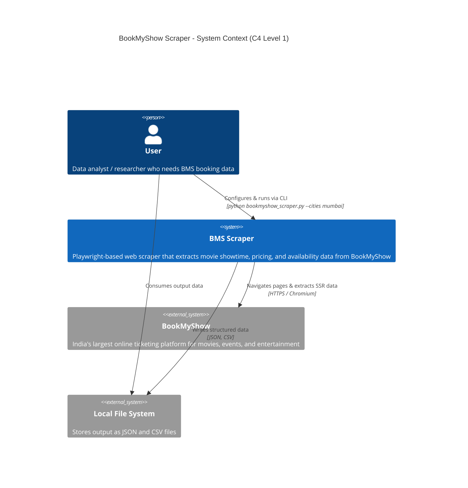
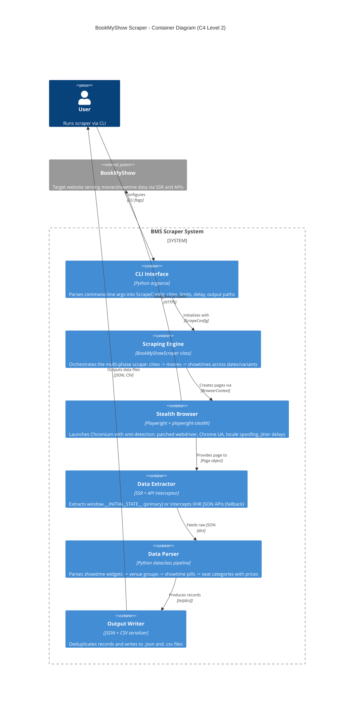
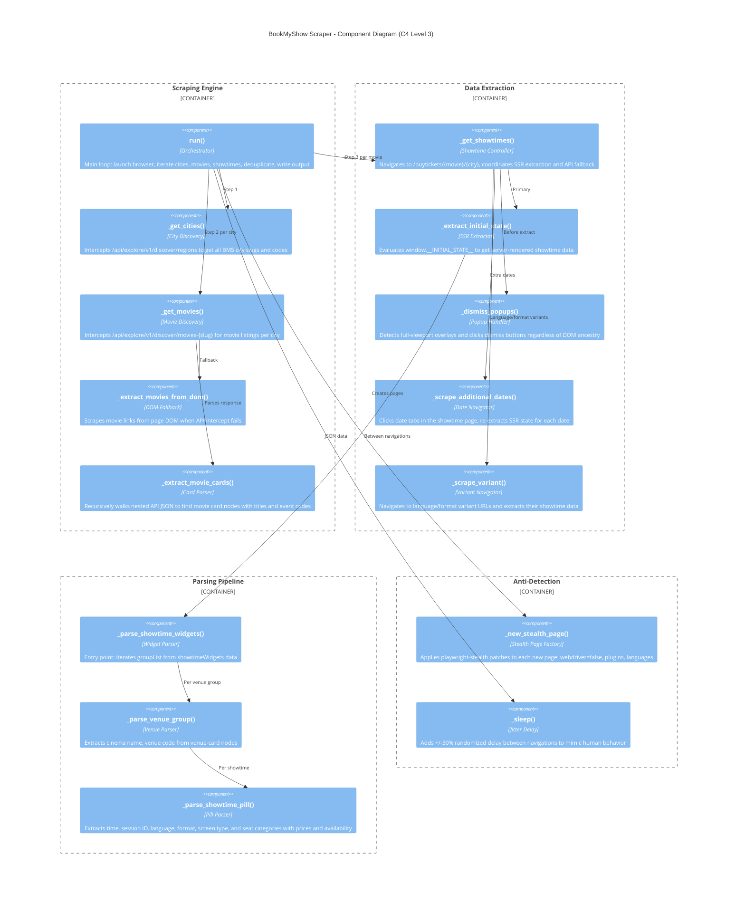

# BookMyShow Scraper — Architecture (C4 Model)

This document describes the architecture of the BMS Scraper using the
[C4 model](https://c4model.com/) by Simon Brown.

---

## Level 1 — System Context

Shows how the scraper fits into the broader landscape: the user, BookMyShow,
and the local file system.

---

## Level 2 — Container Diagram

Breaks the scraper into its major internal containers and shows the data flow
between them.

---

## Level 3 — Component Diagram

Drills into every method and component, grouped by responsibility.

---

## Data Schema

Each scraped record contains:

| Field                   | Description                                      | Example                        |
|-------------------------|--------------------------------------------------|--------------------------------|
| `city`                  | City slug                                        | `bengaluru`                    |
| `movie`                 | Movie title                                      | `Scream 7`                     |
| `event_code`            | BMS event identifier                             | `ET00412345`                   |
| `cinema`                | Cinema / venue name                              | `PVR Orion Mall`               |
| `venue_code`            | BMS venue identifier                             | `PVBN`                         |
| `show_date`             | Show date                                        | `2026-03-07`                   |
| `show_time`             | Show time (24h)                                  | `14:30`                        |
| `session_id`            | BMS session identifier                           | `1234567890123456`             |
| `language`              | Audio language                                   | `English`                      |
| `subtitle_language`     | Subtitle language (if any)                       | `Hindi`                        |
| `format`                | Screening format                                 | `2D`, `IMAX 2D`, `4DX`        |
| `screen_type`           | Screen technology                                | `IMAX`, `Dolby Atmos`         |
| `seat_category`         | Seat tier name                                   | `GOLD`, `CLASSIC`, `PRIME`     |
| `price`                 | Ticket price (INR)                               | `350.00`                       |
| `category_availability` | Seat-tier availability                           | `Available`, `Filling Fast`    |
| `show_availability`     | Overall show availability                        | `Available`, `Almost Full`     |
| `source_url`            | Page URL the data was scraped from               | `https://in.bookmyshow.com/…` |
| `scraped_at`            | UTC timestamp of extraction                      | `2026-03-07T10:30:00Z`        |

---

## Technology Stack

| Layer            | Technology                                             |
|------------------|--------------------------------------------------------|
| Language         | Python 3.12                                            |
| Browser Engine   | Playwright (Chromium)                                  |
| Anti-Detection   | playwright-stealth, custom UA, locale/timezone spoofing|
| Data Extraction  | SSR (`window.__INITIAL_STATE__`) + API interception    |
| Output Formats   | JSON, CSV                                              |
| CLI Framework    | argparse                                               |
